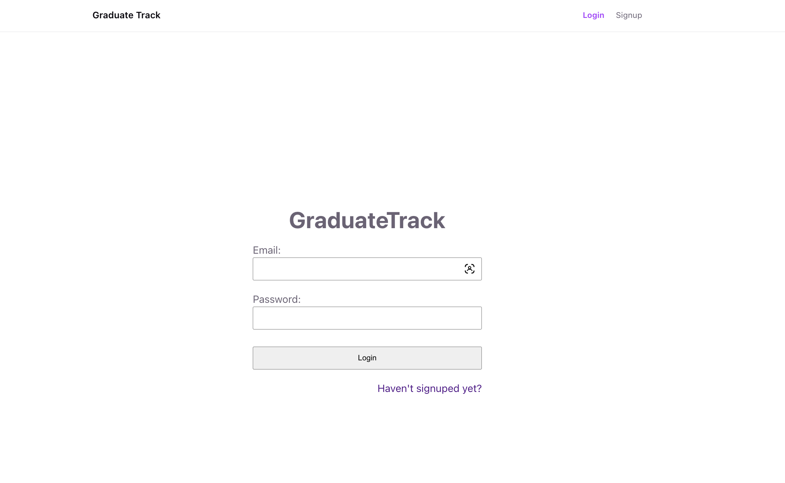
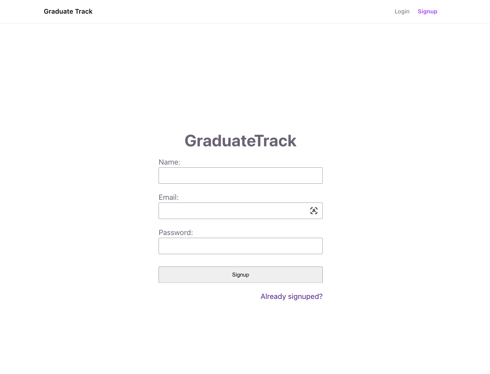
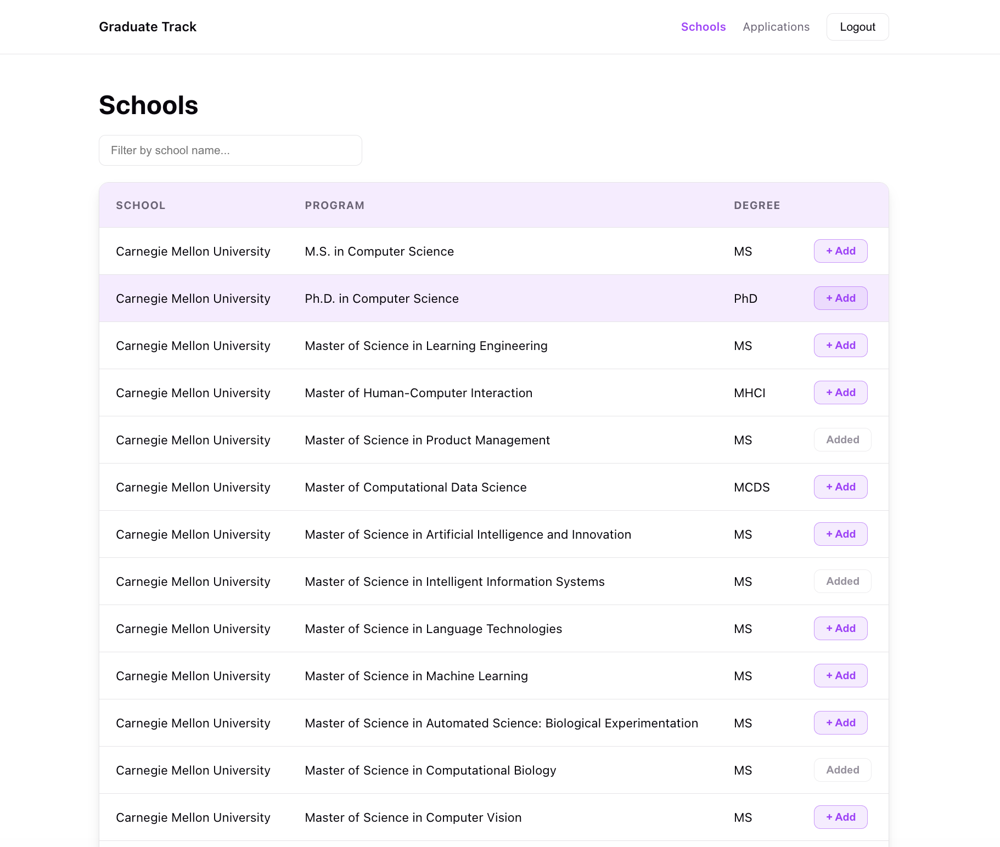
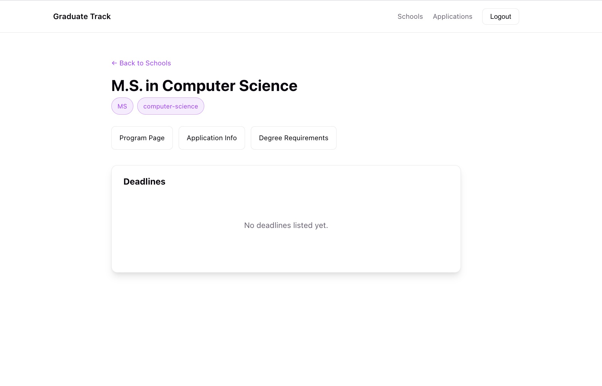
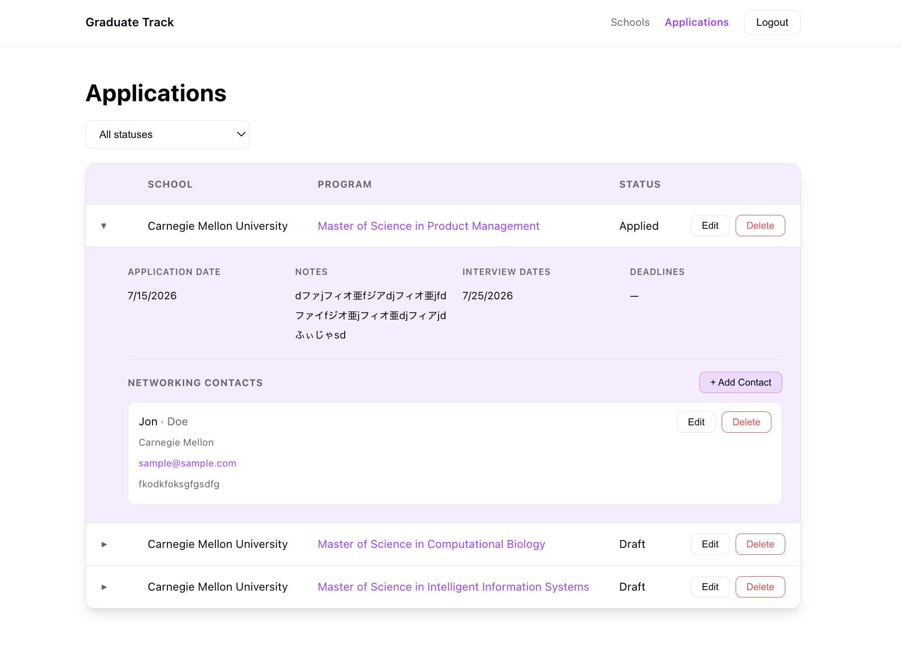
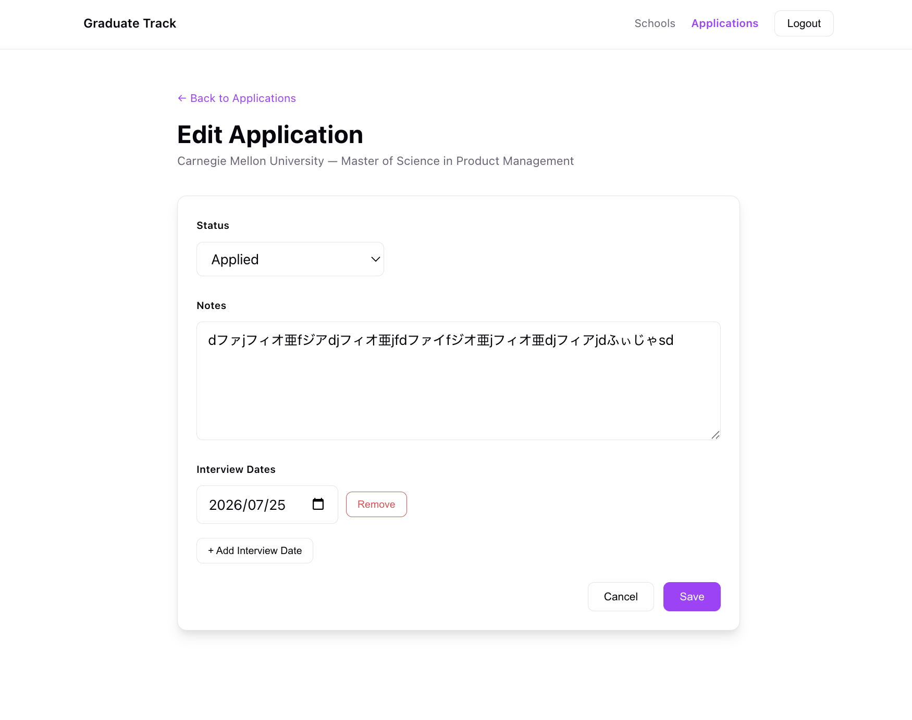

# GraduateTrack

## Project Objective

A graduate school application tracker that helps applicants browse programs, track application status and deadlines, and manage contacts (professors, alumni, admissions staff) tied to each application.

- **Author:** Shota Togawa, Daiwei Zhang
- **Class Link:** https://johnguerra.co/classes/webDevelopment_online_summer_2026/
- **Live demo:** https://zdwww.github.io/graduate-track/
- [**Design Doc**](./DESIGNDOC.md)








## Features

- Sign up and log in with an email/password account; JWT-based authentication protects all data
- Browse a paginated catalog of schools and programs, filterable by school name
- View a program's detail page with degree, field, external links, and deadlines
- Add a program to your applications with one click ("+ Add") from the catalog
- Track each application's status (Draft, Applied, Offered, Rejected), notes, and interview dates
- Edit an application's status, notes, and interview dates from a dedicated edit form
- Delete applications you no longer want to track
- Add, edit, and delete contacts (name, school, role, email, notes) linked to a specific application

**Application statuses:** Draft, Applied, Offered, Rejected

## Tech Stack

| Layer    | Technology                                 |
| -------- | ------------------------------------------ |
| Frontend | React 19 (Hooks, React Router), Vite       |
| Backend  | Node.js, Express 5                         |
| Database | MongoDB (native driver)                    |
| Auth     | Passport (local + JWT strategies), bcrypt  |
| Hosting  | GitHub Pages (frontend) · Render (backend) |

## Project Structure

```
.
├── backend/
│   ├── index.js              # Express app entry point
│   ├── db.js                 # MongoDB connection
│   ├── config/
│   │   └── passport.js       # Local + JWT auth strategies
│   ├── middleware/
│   │   └── auth.js           # requireAuth (JWT) middleware
│   ├── routers/
│   │   ├── auth.js
│   │   ├── applications.js
│   │   ├── contacts.js
│   │   └── schools.js
│   ├── controllers/
│   │   ├── auth.js
│   │   ├── applications.js
│   │   ├── contacts.js
│   │   └── schools.js
│   ├── models/
│   │   ├── Users.js
│   │   ├── Applications.js
│   │   ├── Contacts.js
│   │   └── Schools.js
│   └── constants/
│       └── applications.js   # APPLICATION_STATUS enum
├── docs/                      # Production frontend (served via GitHub Pages)
│   ├── src/
│   │   ├── pages/             # LoginPage, SignupPage, SchoolsPage, SchoolPage,
│   │   │                      # ApplicationsPage, ApplicationEditPage
│   │   ├── components/        # Navigation, Contacts, ContactForm, Loading, ErrorMessage
│   │   ├── helpers/
│   │   │   ├── apis/          # fetch wrappers per resource
│   │   │   ├── constants/     # API base URL, routes, status enum
│   │   │   ├── context/       # AuthContext/AuthProvider
│   │   │   └── hooks/         # useAuth, useSchools, useApplications, useContacts...
│   │   └── App.jsx
│   └── vite.config.js
└── package.json
```

## Getting Started

### Prerequisites

- Node.js 18+
- MongoDB running locally on `mongodb://localhost:27017`

### Installation

```bash
git clone https://github.com/zdwww/graduate-track.git
cd graduate-track
npm install          # root tooling (eslint, prettier, husky)
cd backend && npm install && cd ..
cd docs && npm install && cd ..
```

### Running locally

```bash
# Terminal 1 — backend (http://localhost:3000)
cd backend
npm start

# Terminal 2 — frontend (http://localhost:5174)
cd docs
npm run dev
```

The frontend auto-detects `localhost` and points API requests to `http://localhost:3000/api`.

### Environment variables

Set these in `backend/.env` (see `backend/.env.sample`):

| Variable      | Default                     | Description                              |
| ------------- | --------------------------- | ---------------------------------------- |
| `MONGODB_URI` | `mongodb://localhost:27017` | MongoDB connection string                |
| `DB_NAME`     | `graduate_tracker`          | Database name                            |
| `JWT_SECRET`  | —                           | Secret used to sign auth JWTs (required) |

## Usage

Once the app is running locally (or on the [live demo](https://zdwww.github.io/graduate-track/)):

1. **Sign up / log in** — create an account on the Signup page or log in on the Login page. A JWT is stored client-side and attached to all subsequent API requests.
2. **Browse schools** — the home page lists programs from the school catalog. Filter by school name and page through results.
3. **View a program** — click a row to see its detail page: degree, field, external links, and deadlines.
4. **Add an application** — click **+ Add** on a program row to start tracking it; the button becomes disabled once the program has been added.
5. **Manage applications** — the Applications page lists everything you're tracking. Click a row to expand it and see the application date, notes, interview dates, and contacts.
6. **Edit an application** — click **Edit** to change its status, notes, and interview dates, then **Save**.
7. **Delete an application** — click **Delete** and confirm; this removes the application (its contacts remain queryable by `applicationId` but are no longer reachable from the UI).
8. **Manage contacts** — from an expanded application row, add a contact (name, school, role, email, notes) and edit or delete existing contacts inline.

## API Reference

Base URL (production): `https://graduate-track-api.onrender.com/api`

All endpoints except `/auth/register` and `/auth/login` require an `Authorization: Bearer <token>` header.

### Auth

| Method | Endpoint         | Description                                       |
| ------ | ---------------- | ------------------------------------------------- |
| `POST` | `/auth/register` | Create an account (`name`, `email`, `password`)   |
| `POST` | `/auth/login`    | Log in with `email` and `password`, returns a JWT |
| `GET`  | `/auth/me`       | Get the current authenticated user                |

### Schools

| Method | Endpoint              | Description                         |
| ------ | --------------------- | ----------------------------------- |
| `GET`  | `/schools`            | List programs in the school catalog |
| `GET`  | `/schools/:programId` | Get a single program by ID          |

### Applications

| Method   | Endpoint                      | Description                          |
| -------- | ----------------------------- | ------------------------------------ |
| `GET`    | `/applications`               | List applications                    |
| `POST`   | `/applications`               | Create an application from a program |
| `GET`    | `/application/:applicationId` | Get a single application             |
| `PATCH`  | `/application/:applicationId` | Update an application                |
| `DELETE` | `/application/:applicationId` | Delete an application                |

### Contacts

| Method   | Endpoint                   | Description                                                          |
| -------- | -------------------------- | -------------------------------------------------------------------- |
| `GET`    | `/contacts?applicationId=` | List the current user's contacts, optionally filtered by application |
| `POST`   | `/contacts`                | Add a contact to an application                                      |
| `GET`    | `/contact/:contactId`      | Get a single contact                                                 |
| `PATCH`  | `/contact/:contactId`      | Update a contact (`name`, `school`, `role`, `email`, `notes`)        |
| `DELETE` | `/contact/:contactId`      | Delete a contact                                                     |

### `POST /auth/register` request body

```json
{
  "name": "Elena Diaz",
  "email": "elena@example.com",
  "password": "at-least-8-characters"
}
```

**Response**

```json
{
  "token": "...",
  "user": { "id": "...", "email": "elena@example.com", "name": "Elena Diaz" }
}
```

### `POST /applications` request body

```json
{
  "schoolName": "Northeastern University",
  "programId": "abc123",
  "programName": "MS Computer Science",
  "deadlines": [{ "term": "Fall", "date": "2026-12-01" }]
}
```

`status` defaults to `Draft`. `notes`, `interviewDates`, and `applicationDate` are set by the server.

### `POST /contacts` request body

```json
{
  "applicationId": "665f1...",
  "name": "Dr. Jane Smith",
  "school": "Northeastern University",
  "role": "Admissions Committee",
  "email": "jsmith@example.edu",
  "notes": "Met at the virtual open house."
}
```

`applicationId` and `name` are required; `school`, `role`, `email`, and `notes` are optional.

## License

MIT

## Code Review (for Shota, from Claire)

- Very organized, every type of file is properly separated into folders
- All the code in all of your (Shota's) commits looks clear and concise. 
- Really like the cohesive styling across the pages you worked on
- It was very helpful to include screenshots of what you added/worked on in the pull requests - made it easy to identify what you worked on
- Specifically was good attention to detail to disable the add button if the application was already added
- One thing that I think is a good thing for more complex projects that you incorporated is the use of different branches based on the feature being worked on. While I think that a new branch for every new commit is a little bit overkill it is a good strategy to keep all the versions clear - and directly make sure only want you want has been committed 
- I also appreciate how detailed your readme was, specifically the project structure was helpful for identifying all the features and components - one thing I would change in the future is I would label your frontend folder “frontend” vs “docs” that was a bit confusing

While I didn't see any code issues, and testing the website everything worked properly, I would recommend that in future versions to include more ways to filter through applications. It is helpful to filter by school name but I believe it would be even more helpful to users if they could filter by any field (ex. MS/PHD, program type, etc).
